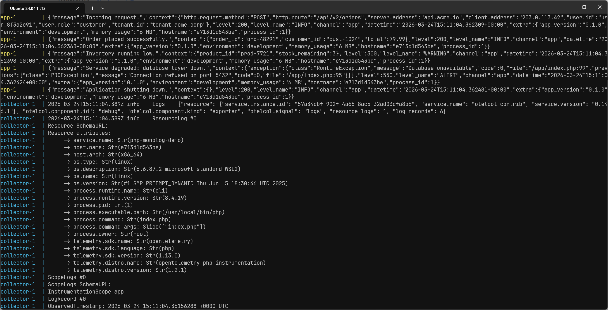

# PHP Logging with Monolog

Companion repository for the Dash0 guide:
[PHP Logging with Monolog: A Complete Guide](https://www.dash0.com/guides/monolog-logging-php).

This playground spins up a PHP script alongside an OpenTelemetry Collector so
you can see structured Monolog output and its OTel-normalized equivalent side by
side.

## What's inside

The PHP application in `index.php` exercises the key patterns from the guide:

- Structured JSON output via `JsonFormatter`
- Built-in processors (`ProcessIdProcessor`, `HostnameProcessor`,
  `MemoryUsageProcessor`)
- A custom processor for application-level metadata
- Exception logging with chained causes
- The OpenTelemetry Monolog handler for OTLP export

The Collector is configured with the OTLP receiver and the debug exporter, so
every log record the application sends is printed in the OpenTelemetry format to
the Collector's stdout.

## Prerequisites

- [Docker](https://docs.docker.com/get-docker/) and Docker Compose installed.

That's it. You don't need PHP or Composer on your host machine.

## Quick start

```bash
git clone https://github.com/dash0hq/
cd php-monolog-logging
docker compose up --build
```

You will see two interleaved streams of output:

1. **The PHP application** emits structured JSON logs to stdout (prefixed with
   `app-1` in the Docker Compose output).
2. **The Collector** prints the same events in the OpenTelemetry log format
   after receiving them via OTLP (prefixed with `collector-1`).

Comparing the two is the fastest way to see how Monolog logs are transformed as
they flow through an OTel pipeline.



## Experimenting

Edit `index.php` to try out different configurations from the article, then
rebuild and re-run:

```bash
docker compose up --build
```

Some things to try:

- Change the console handler's level to `Level::Warning` and observe which logs
  still appear in JSON output versus which still reach the Collector.
- Remove or add processors to see how the `extra` field changes.
- Add new context attributes to a log call and watch them appear as OTel
  attributes in the Collector output.
- Swap `JsonFormatter` for the default `LineFormatter` to compare human-readable
  and structured output.

## Sending logs to Dash0

To send logs to Dash0 instead of the `debug` exporter, uncomment the
`otlp_http/dash0` block in `otelcol.yaml`, then ensure `otlp_http/dash0` is
present in the `exporters` array as follows:

```yaml
# otelcol.yaml
[...]

exporters:
  otlp_http/dash0:
    endpoint: https://${env:DASH0_ENDPOINT_OTLP_HTTP_HOSTNAME}
    headers:
      Authorization: Bearer ${env:DASH0_AUTH_TOKEN}
      Dash0-Dataset: ${env:DASH0_DATASET}

service:
  pipelines:
    logs:
      receivers: [otlp]
      exporters: [otlphttp/dash0]
```

Configure your Dash0 credentials in `../.env` (copy from `../.env.template`)
before relaunching the services with:

```bash
docker compose up -d --force-recreate
```

Don't forget to sign up for a free trial at
[dash0.com](https://www.dash0.com/sign-up) to get your ingress endpoint and
token.

## Cleanup

```bash
docker compose down
```
